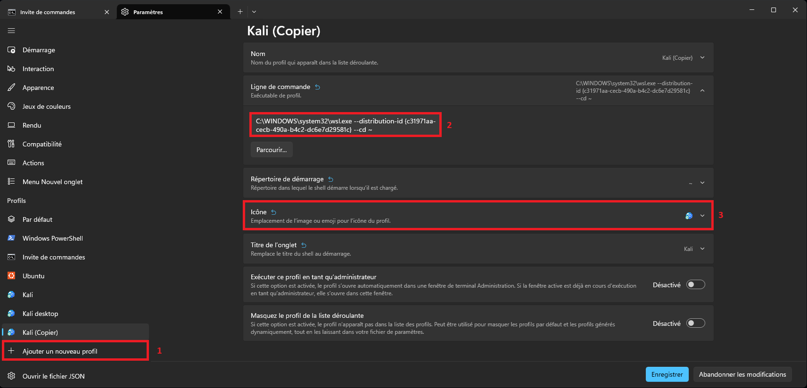

>[!note]
>La documentation [suivante](https://learn.microsoft.com/en-us/windows/wsl/install) de microsoft définie les étapes d'installation d'une machine virtuelle Linux via la fonctionnalité WSL de Windows. Ce court tutoriel s'y appuie afin de montrer comment installer une machine virtuelle Kali Linux avec une interface graphique sur votre système hôte Windows sans passer par une solution tiers d'éditeurs comme WMWare ou Virtual Box d'Oracle.

1) Ouvrez un terminal PowerShell en mode **administrateur**, puis tapez les commandes suivantes sous Windows 11.

```PowerShell
wsl.exe --list --online
```

```PowerShell
wsl.exe --install kali-linux
```

2) Redémarrez votre ordinateur une fois l'aboutissement de la commande d'installation de Kali Linux via WSL.

3) Ouvrez un terminal dans votre machine virtuelle WSL Kali Linux en CLI.


4) Mettez à jour votre machine virtuelle et installez le package "Win-Kex".

```Bash
sudo apt update
```

```Bash
sudo apt install -y kali-win-kex
```

5) Ouvrez les paramètres de votre terminal Windows afin de créer le raccourci vers Kali Linux en GUI.


6) Cliquez sur "Ajouter un nouveau profil" sur le bandeau de gauche, puis sélectionnez le profil "kali-linux" dans le menu déroulant afin de depliquer celui-ci.



7) Ajoutez à la ligne de commande existante "kex --wtstart -s" afin d'obtenir :

```Bash
C:\WINDOWS\system32\wsl.exe --distribution-id {ID} kex --wtstart -s
```

8) Vous pouvez changer le nom ou encore l'icône du profil pour par exemple y mettre celle de "[kali_menu.png](https://gitlab.com/kalilinux/packages/kali-menu/-/blob/kali/master/menu-icons/32x32/apps/kali-menu.png)".

9) Cliquez sur le bouton "Enregistrer" puis vous pourrez constater que ce profil devient accessible via son raccourci dans votre terminal.

Vous pouvez modifier le mode d'affichage de Win-kex en vous appuyant sur cette documentation de [kali.org](https://www.kali.org/docs/wsl/win-kex-win/).

>[!note]
>On note que l'avantage du WSL est la rapidité et simplicité avec laquelle on peut accéder à une VM Linux sans passer par du dual boot. Cependant, WSL ne propose pas de fonctionnalité de snapshot pourtant utile pour un pentester car lui permettant de revenir à une configuration de base sans avoir à flush l'entièreté de la machine virtuelle.
>
>En définitive, il est certainement plus judicieux d'utiliser la fonctionnalité WSL avec une machine virtuelle Ubuntu sur laquelle serait installé [Exegol](https://exegol.com/).

