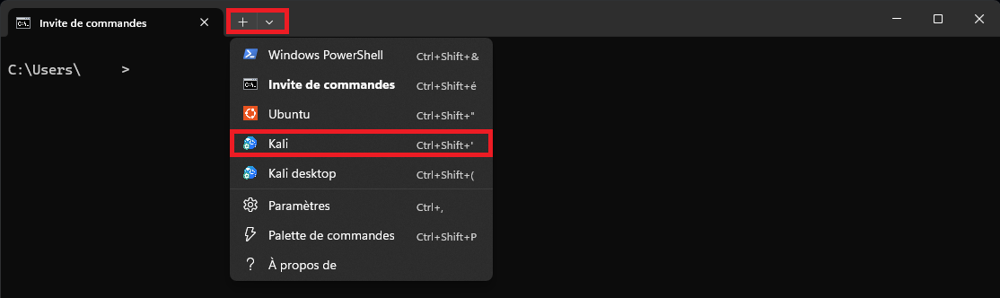
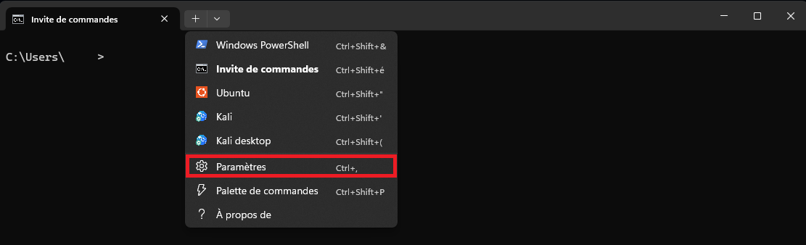

1) Ouvrez un terminal PowerShell en mode **administrateur**, puis tapez les commandes suivantes sous Windows 11.

```PowerShell
wsl.exe --list --online
```

```PowerShell
wsl.exe --install kali-linux
```

2) Redémarrez votre ordinateur une fois l'aboutissement de la commande d'installation de Kali Linux via WSL.

3) Ouvrez un terminal dans votre machine virtuelle WSL Kali Linux en CLI.



4) Mettez à jour votre machine virtuelle et installez le package "Win-Kex".

```Bash
sudo apt update
```

```Bash
sudo apt install -y kali-win-kex
```

5) Ouvrez les paramètres de votre terminal Windows afin de créer le raccourci vers Kali Linux en GUI.



6) 